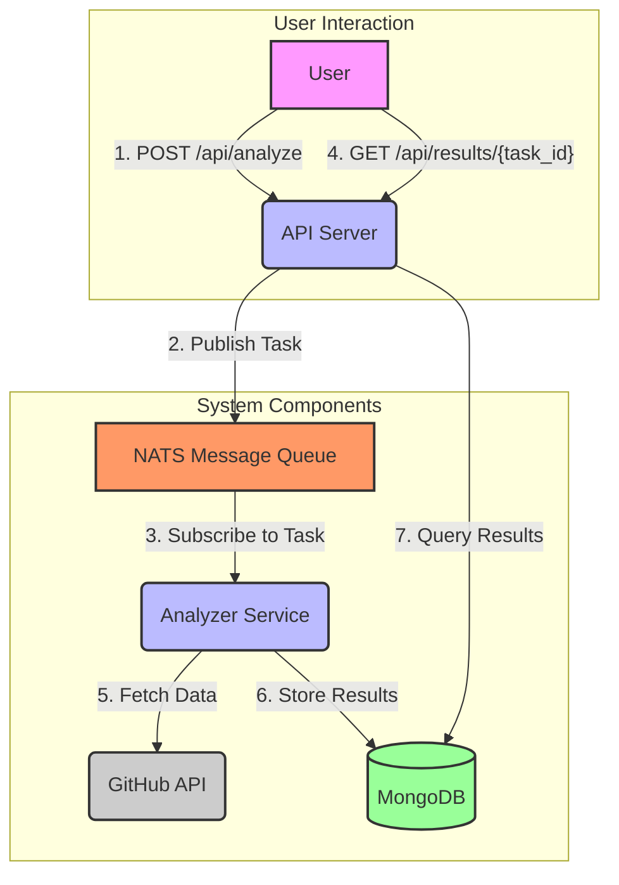

# ContribPulse - 專案貢獻度查詢系統

這是一個使用 Go、REST API、Docker、Nats 和 MongoDB 建立的專案貢獻度查詢系統。

## 功能

*   **非同步分析**: 透過 NATS 實現非同步的 GitHub 儲存庫分析。
*   **貢獻度統計**: 分析指定儲存庫的 commits, pull requests 和 issues，並找出前十大貢獻者。
*   **REST API**: 提供 API 端點來觸發分析並查詢結果。

## 技術

*   **後端**: Go
*   **API**: REST API (net/http)
*   **訊息佇列**: NATS
*   **資料庫**: MongoDB
*   **容器化**: Docker, Docker Compose
*   **部署**: Kubernetes

## 架構圖



## 本地部署 (使用 Docker Compose)

1.  **建立 `.env` 檔案**:
    在專案根目錄下建立一個 `.env` 檔案，並在其中加入您的 GitHub Personal Access Token：
    ```
    GITHUB_TOKEN=YOUR_PERSONAL_ACCESS_TOKEN
    ```

2.  **啟動服務**:
    ```bash
    docker-compose up --build -d
    ```

3.  **測試 API**:
    *   **發送分析請求** (請將 `<https://github.com/owner/repo>` 替換為想查詢的公開專案):
        ```bash
        curl -X POST -H "Content-Type: application/json" -d '{"repo_url": "<https://github.com/owner/repo>"}' http://localhost:8080/api/analyze
        ```
    *   **查詢分析結果** (請將 `<task_id>` 替換為上一步回傳的 ID):
        ```bash
        curl http://localhost:8080/api/results/<task_id>
        ```
    *   **成果範例**:
        ```json
        {
            "processed_at": "2025-07-30T08:33:09.626Z",
            "repo_url": "https://github.com/baiyuchen1228/baiyuchen1228.github.io",
            "summary": {
                "top_contributors": [
                    {
                        "commits": 271,
                        "login": "baiyuchen1228"
                    },
                    {
                        "commits": 200,
                        "login": "forward0606"
                    },
                    {
                        "commits": 13,
                        "login": "dependabot[bot]"
                    }
                ],
                "total_commits": 484,
                "total_issues": 27,
                "total_prs": 27
            },
            "task_id": "2bea743a-dd09-466a-9f60-edb0c6d66879"
        }
        ```

4.  **停止服務**:
    ```bash
    docker-compose down
    ```

## 本地部署 (使用 Kubernetes / Minikube)

1.  **啟動 Minikube**:
    ```bash
    minikube start
    ```

2.  **建立 `.env` 檔案**:
    在專案根目錄下建立一個 `.env` 檔案，並在其中加入您的 GitHub Personal Access Token：
    ```
    GITHUB_TOKEN=YOUR_PERSONAL_ACCESS_TOKEN
    ```

3.  **一行部署指令**:
    ```bash
    kubectl create secret generic github-token-secret --from-env-file=.env && kubectl apply -f k8s/
    ```

4.  **驗證部署狀態**:
    ```bash
    kubectl get pods
    kubectl get deployments
    kubectl get services
    ```

5.  **測試 API**:
    *   **獲取 `api-server` 的 URL**:
        ```bash
        minikube service api-server --url
        ```
    *   **發送分析請求** (請將 `<api-server-url>` 替換為上一步回傳的 URL):
        ```bash
        curl -X POST -H "Content-Type: application/json" -d '{"repo_url": "https://github.com/owner/repo"}' <api-server-url>/api/analyze
        ```
    *   **查詢分析結果** (請將 `<task_id>` 替換為上一步回傳的 ID):
        ```bash
        curl <api-server-url>/api/results/<task_id>
        ```

6.  **一行清理指令**:
    ```bash
    kubectl delete -f k8s/ && kubectl delete secret github-token-secret
    ```

7.  **停止 Minikube**:
    ```bash
    minikube stop
    ```
